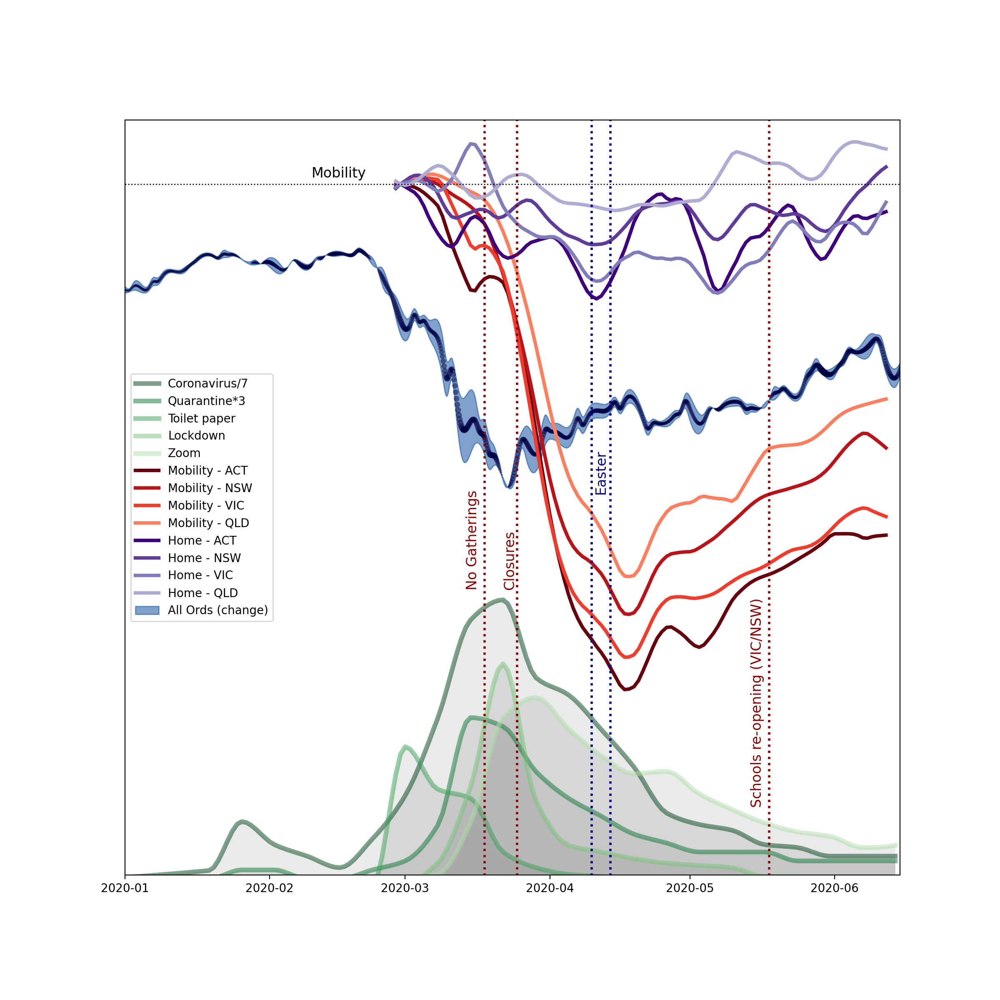

<!-- #region -->
# Ground Motion Displacement RMS vs Time


This repository is a self-updating version of the [seismic social-distancing "monitoring" toolkit](https://github.com/ThomasLecocq/SeismoRMS) of Thomas Lecocq, Fred Massin, and Claudio Satriano that was designed to show the effect on seismic noise of stay-at-home orders for the COVID19 emergency. The notebook software is bundled with some code to trigger github actions to download any new data and update the images in this README file.

This example is from the Keysborough Secondary College in Victoria, Australia - part of the Australian Seismometers in Schools network. 

If you want to try it, fork the template repository and follow the [instructions below](#Help)
<!-- #endregion -->

## Classic plot


## Hourly plot


## Health checker 

Verify that the daily data is complete and monitor the updates from [this plot](results/latest-gridmap.png). If days are incomplete, try deleting the .npz file that is cached and it will be rebuilt when you run the notebook locally or when the scheduled job re-runs (assuming the data are available on the server).

## Tabulated results

The [tabulated output](results/latest.csv) of the run is also available.

## Help

This is a template repository that you can fork to monitor a single seismic station and build a day-by-day picture of the seismic noise spectrum over time. The tools are a clone of the work by Thomas Lecocq, Fred Massin, and Claudio Satriano that is available [here](https://github.com/ThomasLecocq/SeismoRMS). We have bundled a github action [workflow file](.github/workflows/notebook_runner.yml) with this repository that downloads new data each day and updates the plots. These new plots (and the data cache) are uploaded back into the repository itself so that this README file always shows the latest information.

Once you fork a copy of the repository, you should update the settings in the `notebooks/seismosocialdistancing_settings.py` file. The settings allow you to choose a station, the time period of the plot (including setting some sliding window such as *one year ago to today*, the description for the charts, and the signficicant dates for school bans or holidays. The final entry in the list of signficicant dates is considered the cross-over between *before* and *after* for the point of view of comparing the noise signatures.

To run the notebook to check everything is ok just run the `notebook_runner.sh` script. This will download all the data, process it and build the plots. You can check in the .npz files in the data directory to save time when the scripts run online, but you should avoid checking in the large `data/*mseed` files or anything that is located in `workdir`. By default, these files will be ignored by git. Take care that the github actions will update the repository. You should pull before editing.

Don't forget to update this README.md file !

### AuSIS stations

A list of the AuSIS stations can be obtained with this code snippet. 

```python
from obspy.clients.fdsn import Client
from obspy import UTCDateTime

c = Client("IRIS")
print(c.get_stations(UTCDateTime(), network="S1", channel="BHZ"))
```

### Community indicators

The data and scripts to make this plot are provided in the notebooks directory. 



but this does not automatically update because the searches for the data are not yet fully automated. 

